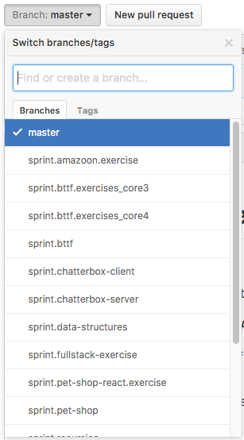

## MKS 48 Sprint Repo Workflow

### Initial Setup (do this once):

1. Fork makersquare/mks-48-sprints:


This will create a copy of this repo on your remote Github account. You will use it to push up the work you do on each sprint. The code for each sprint should go on a **separate branch**.

Your branches will look something like this at the end of the first six weeks:



### Sprint Setup (do this before every sprint!)

1. Download the exercise code from the [Learn App](https://learn.makerpass.com)
1. Extract the directory
1. `cd` into the folder via the command line
1. Run the following commands:

```bash
$ ./init
$ git remote add YOUR_NAME https://github.com/YOUR_GITHUB_USERNAME_HERE/mks-48-sprints
$ git remote add YOUR_PARTNER'S_NAME https://github.com/YOUR_PARTNER'S_GITHUB_USERNAME_HERE/mks-48-sprints
```

### Sprint Changes

Do this every time you get something working or complete a feature / section of code:

```bash
$ git status
$ git add FILENAME # (For new files)
$ git add -p       # (For files that git is already tracking)
$ git commit -m "short and concise description of changes"
$ git push YOUR_REMOTE_NAME head
$ git push YOUR_PARTNERS_REMOTE_NAME head # head points to your current branch
$ git status
```

### Visual of Basic Workflow


### Glossary:

* _git init_ - Initializes a new local Git repository inside your current directory
* _git status_ - Confirms if there are any staged changes. Staged changes are local changes you've made to files that have not been committed.
* _git add -p_ - Adds changes you've made, one chunk at a time. Usage:
  - Type `y` to add the change
  - Type `n` to skip the change (it'll still be there)
  - Type `s` to break a big chunk into smaller chunks
  - Type `q` to quit
* _git commit_ - records changes to your repository
* _git remote_ - a url pointer to a remote repo on Github that you are connecting to your local Git repository. This will allow you to push changes you make locally to your remote, or pull down changes you've saved to your remote repo, locally.
* _git push_ - updates branch on remote repo with changes made locally
